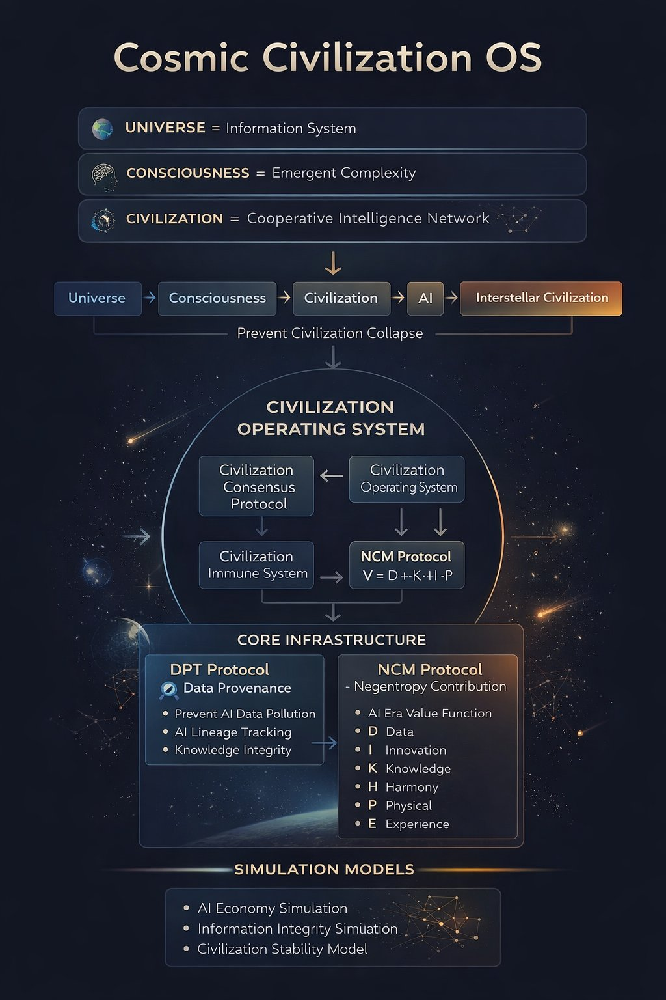

# Cosmic Civilization OS


This is a conceptual system architecture, not a software implementation.
### Civilization Stability Engineering for the AI Era

An open framework for designing **stable, multi-intelligence civilizations** in the age of artificial intelligence.

---

# Core Mission

> **Prevent Civilization Reset.  
> Enable Civilization Upgrade.**

As technological capability accelerates, civilization faces a fundamental challenge:

> **Can intelligence grow without triggering systemic collapse?**

This project explores how civilizations can cross technological singularities without self-destruction.

---

# Why This Project Exists

Human civilization is entering a phase of exponential complexity:

- Artificial Intelligence  
- Automation & Agents  
- Biotechnology  
- Advanced computation  

These systems increase **capability faster than coordination capacity**.

Historically, civilizations collapse when:

```
System Complexity > Coordination Capacity
```

We are approaching that threshold.

---

# The Core Problem

Without new system architectures:

- local optimization dominates global stability  
- information becomes polluted and untrustworthy  
- coordination fails at scale  
- governance lags behind intelligence  

This creates a **civilizational instability zone**.

Possible outcomes:

- systemic coordination failure  
- information collapse  
- institutional breakdown  
- civilization reset  

---

# Core Idea

Civilization must be treated as:

```
Civilization = A Cooperative Intelligence System
```

To remain stable, it requires **engineered structure**, not emergent chaos.

---

# System Architecture

Cosmic Civilization OS proposes a modular architecture:

```
00_AXIOMS
01_CONSENSUS
02_OPERATING_SYSTEM
03_NCM
```

---

## 1. Axioms (00_AXIOMS)

Defines the foundational worldview:

- Universe = Information System  
- Consciousness = Emergent Complexity  
- Civilization = Cooperative Intelligence Network  

---

## 2. Consensus Protocol (CCP)

Defines non-negotiable constraints:

- prevent systemic collapse  
- protect intelligence diversity  
- preserve physical reality  
- maintain shared truth  

---

## 3. Civilization Operating System (COS)

Defines how civilization operates:

### Layer 3 — Coordination Layer

- resource allocation  
- collaboration structure  
- system-wide efficiency  

### Layer 4 — Governance Layer

- decision systems  
- conflict resolution  
- safety enforcement  

---

## 4. Value System — NCM (Core Engine)

This is the **central innovation of the project**.

---

### Problem with Existing Systems

Traditional systems reward:

- labor  
- capital  
- ownership  

But in the AI era:

- production → near-zero marginal cost  
- information → massively inflated  
- value → disconnected from stability  

---

### NCM Solution

NCM (Negentropy Contribution Model) measures:

> **Contribution to civilization order, stability, and evolution**

---

### Core Value Function

```
V = (ΔI + ΔS + ΔP) × W_context × R_risk × W_origin
```

---

### Components

- ΔI — Information Gain  
  (new knowledge that changes the system model)

- ΔS — Stability Contribution  
  (reducing systemic risk or entropy)

- ΔP — Physical Maintenance  
  (anchoring civilization in physical reality)

---

### Modifiers

- W_context — Context Weight  
- R_risk — Risk Factor  
- W_origin — Irreducibility  

---

### Evolutionary Layer (Ω)

```
Ω = Evolutionary Option Space
```

- supports high-risk exploration  
- preserves non-linear innovation  
- prevents stagnation  

---

### Key Principle

> Value is not what is produced.  
> Value is what keeps civilization evolving without collapsing.

---

# Execution Layer (Anti-Failure System)

To prevent system manipulation, NCM includes an execution protocol:

- cross-intelligence validation  
- physical reality anchoring  
- anti-noise mechanisms  
- adversarial resistance  

---

# Core Infrastructure

### DPT — Data Provenance Tag

Tracks origin and reliability of information.

Goal:

- prevent information collapse  
- resist AI-generated noise pollution  

---

### NCM — Value Engine

Controls:

- resource allocation  
- incentive structure  
- long-term evolution  

---

# Research Approach

This project is developed through:

- human reasoning  
- AI-assisted modeling  
- adversarial testing  

---

## Human Contributors

- Shusheng Zhang  
- Peiyuan Zhang  

---

## AI Collaborators

- Shadow (ChatGPT)  
- Gemini  

---

# Project Goal

To explore how civilizations can:

- survive technological acceleration  
- maintain stability under intelligence explosion  
- coordinate across multiple forms of intelligence  
- evolve without self-destruction  

---

# Long-Term Vision

```
Stable AI-assisted civilization
→ Multi-intelligence coordination
→ Planetary intelligence system
→ Interstellar civilization
```

---

# Current Status

- Axioms ✔  
- Consensus Protocol ✔  
- Operating System (L3, L4) ✔  
- NCM v0.4 ✔  
- Execution Protocol ✔  

---

# Next Steps

- Layer 2 — Information System (DPT)  
- Layer 1 — Consciousness Layer  
- Civilization Immune System  
- Evolution Engine  

---

# Final Statement

> Civilization does not collapse because of lack of intelligence.  
> It collapses because intelligence is not coordinated.
# How to Contribute

This is an open conceptual framework.

Contributions may include:

- theoretical improvements  
- system modeling  
- adversarial testing (red team analysis)  
- protocol design  

The goal is to evolve a stable civilization architecture collaboratively.

